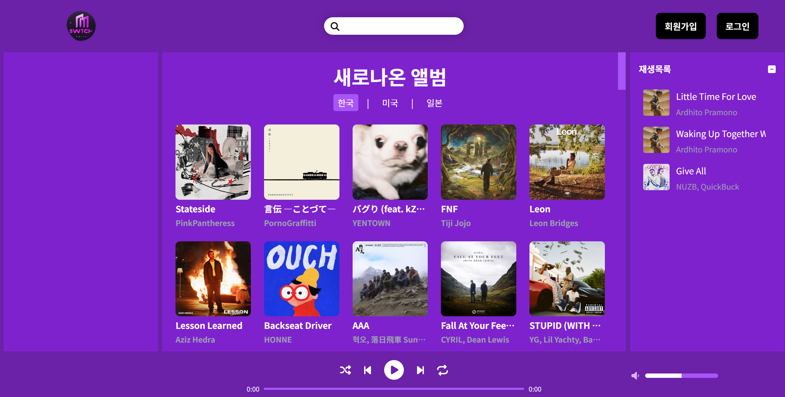
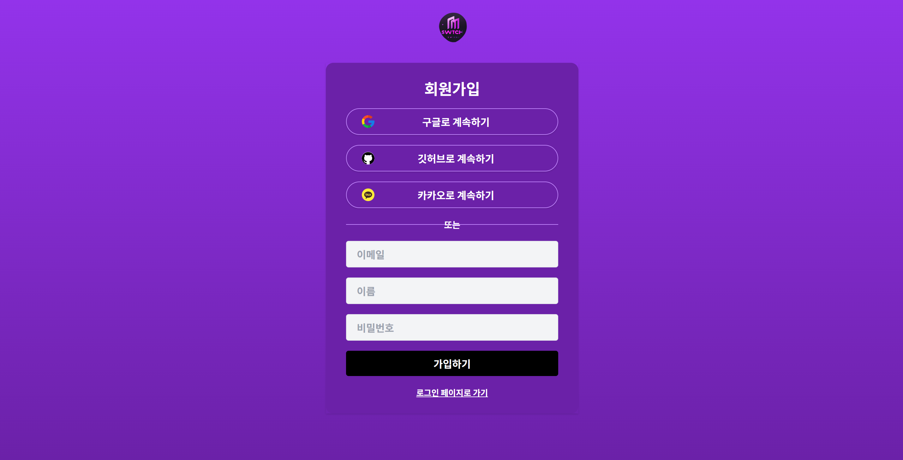
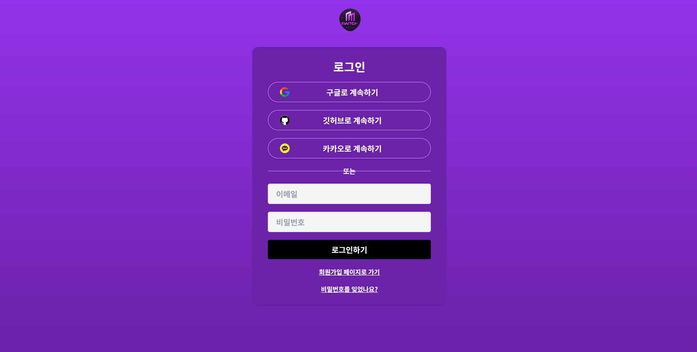
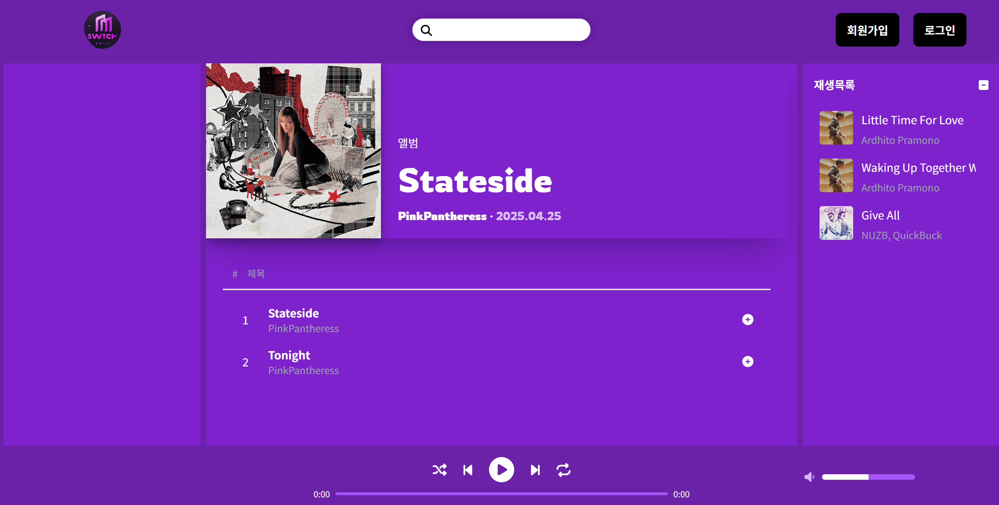
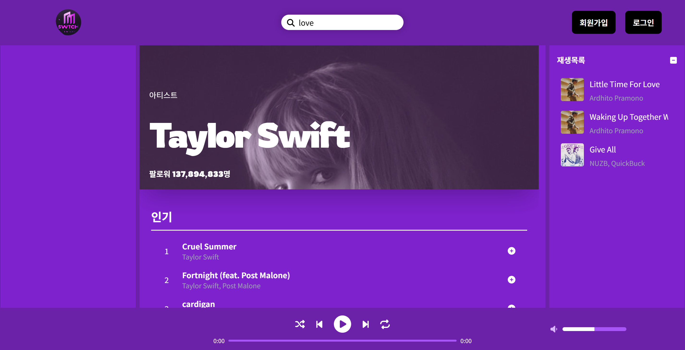
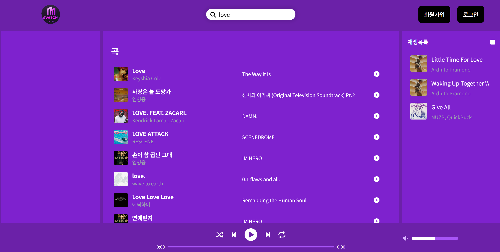

## 실행 방법

1. git clone을 통해 프로젝트를 다운받습니다.

2. 다운받은 폴더를 IDE로 실행합니다.

3. 터미널에 아래의 명령어로 의존성 설치를 합니다.

```
npm install
```

4. 프로젝트의 음악 재생 및 정상적인 동작을 위해 루트 경로에 .env 파일을 만들어야합니다.

```
//.env
VITE_SUPABASE_URL={my-key}
VITE_SUPABASE_ANON_KEY={my-key}

VITE_SPOTIFY_CLIENT_ID={my-key}
VITE_SPOTIFY_CLIENT_SECRET={my-key}

VITE_YOUTUBE_API_KEY={my-key}
```

{my-key}에 자신의 api key를 넣어줍니다. supabase, spotify, youtube의 api key가 필요합니다.

5. 터미널에 아래의 명령어를 입력하여 실행합니다.

```
npm run dev
```

### 🧪 테스트 계정

- ID: `test@test.com`
- PW: `12345`

# Switch - The Fantasy Music App


듣고 싶은 음악을 플레이리스트에 등록해 감상해보세요

## 프로젝트 소개

1. '새로 발매된 앨범(홈)' 페이지를 통해 최신 노래들을 들을 수 있습니다.
2. 앨범 페이지와 아티스트 페이지가 있어서 앨범별 곡 및 아티스트별 곡을 따라 확인할 수 있습니다.
3. 검색 기능을 통해 원하는 음악과 아티스트, 앨범을 찾을 수 있습니다.
4. 원하는 음악을 플레이리스트에 추가하여 나만의 플레이리스트를 만듭니다.

## 기술 스택

<div>
  


</div>

## 주요 기능

 <table>
    <tr>
      <td align="center">회원가입</td>
      <td align="center">로그인</td>
    </tr>
    <tr>
      <td align="center"></td>
      <td align="center"></td>
    </tr>
    <tr>
      <td align="center">새로 발매된 앨범(홈)</td>
      <td align="center">앨범</td>
    </tr>
    <tr>
      <td align="center"></td>
      <td align="center"></td>
    </tr>
    <tr>
      <td align="center">아티스트</td>
      <td align="center">검색</td>
    </tr>
    <tr>
      <td align="center"></td>
          <td align="center"></td>
    </tr>
   
   
 </table>

### 비로그인

비로그인시에도 음악 듣기 및 플레이리스트 등록이 가능합니다.(로그인했을 때와의 차이점은 로그인을 하면 계정에 종속된 플레이리스트를 만들 수 있습니다.)

### 플레이리스트

곡 옆에 배치된 +기호 또는 재생 버튼을 눌러서 플레이리스트에 음악을 추가할 수 있습니다.

## 개발 일지

- [Honey 개발 일지](https://keen-blue-f02.notion.site/Honey-bae4439c30c44725ad8b61d85ccf9c00)
